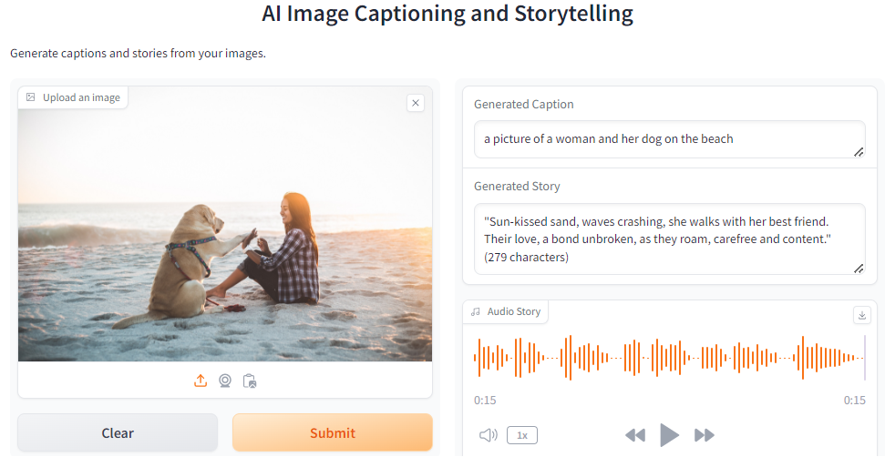

<div align="center">

# 🖼️ VisionVoice Storyteller

### *Transforming Visual Moments into Narrated Stories*

[](https://www.python.org/)
[](https://pytorch.org/)
[](https://huggingface.co/)
[](https://gradio.app/)
[](https://colab.research.google.com/github/afondiel/computer-vision-challenge/blob/main/L2_05_AI_Driven_Image_Captioning_and_Storytelling/AI_Image_Captioner_Storyteller.ipynb)

---

**A complete end-to-end computer vision pipeline that takes any image as input, generates a descriptive caption using BLIP, crafts a creative short story using LLMs (Zephyr-7B / LLaMA), and converts it into lifelike spoken audio using XTTS-v2 — all in one seamless flow.**

</div>

---

## 📋 Table of Contents

- [Problem Statement](#-problem-statement)
- [Why This Matters](#-why-this-matters)
- [System Architecture](#-system-architecture)
- [Pipeline Overview](#-pipeline-overview)
- [Demo](#-demo)
- [Tech Stack](#-tech-stack)
- [Installation & Setup](#-installation--setup)
- [Usage](#-usage)
- [Sample Output](#-sample-output)
- [Model Performance](#-model-performance)
- [Project Structure](#-project-structure)
- [Key Design Decisions](#-key-design-decisions)
- [Challenges & Learnings](#-challenges--learnings)
- [References](#-references)
- [License](#-license)

---

## 🎯 Problem Statement

> **How can we make visual content universally accessible and emotionally engaging through AI?**

Millions of images are shared daily, yet they remain inaccessible to visually impaired individuals and lack the emotional depth that a narrative can provide. Existing image captioning tools produce dry, factual descriptions — they tell you *what* is in an image, but not *what it means*.

This project solves a real-world accessibility and creativity problem by building a **multi-modal AI pipeline** that:
1. **Sees** — Understands the visual content of any image
2. **Writes** — Generates a creative, emotionally resonant story
3. **Speaks** — Converts the story into natural-sounding audio

---

## 💡 Why This Matters

| Problem | Our Solution |
|:--------|:-------------|
| 🔇 Images are inaccessible to visually impaired users | Audio narration makes visual content audible |
| 📝 Automated captions are bland and factual | LLM-powered storytelling adds creativity and emotion |
| 🧩 Existing tools solve only one piece of the puzzle | End-to-end pipeline handles Image → Caption → Story → Audio |
| 🌍 Language models lack visual grounding | BLIP bridges vision and language with conditional captioning |

### Course Relevance
This project directly applies core **Computer Vision** concepts:
- **Image Understanding** — Using pre-trained vision-language models (BLIP) for image captioning
- **Feature Extraction** — Leveraging CNN/Transformer-based visual encoders
- **Multi-modal Learning** — Connecting vision (images) with language (text) and speech (audio)
- **Transfer Learning** — Fine-tuning and leveraging pre-trained models for downstream tasks
- **Deep Learning Architectures** — Working with Transformers, attention mechanisms, and encoder-decoder models

---

## 🏗️ System Architecture

<div align="center">


*Figure 1: End-to-end system architecture showing the three-stage pipeline*

</div>

The pipeline consists of three core deep learning modules connected in sequence:

```
┌─────────────┐    caption    ┌─────────────────┐    story    ┌───────────────┐
│  📷 Input   │ ────────────► │  📝 Story       │ ──────────► │  🔊 Audio     │
│    Image    │               │    Generator    │             │    Output     │
│             │               │                 │             │               │
│  BLIP       │               │  Zephyr-7B /    │             │  Coqui        │
│  Img-to-Txt │               │  LLaMA / Phi-3  │             │  XTTS-v2      │
└─────────────┘               └─────────────────┘             └───────────────┘
```

### Pipeline Flow Diagram

```mermaid
flowchart LR
    subgraph Pipeline
        direction LR
        subgraph Input
            direction TB
            A([Story Prompt])
            B[/Image/]
        end
        subgraph Img2Story
            direction LR
            C(Img-2-Txt)--caption-->D(Txt-2-Txt)
            D--story-->E(Txt-2-Audio)
        end
        A-->Img2Story
        B-->Img2Story
        Img2Story-->X([📖 Read Story])
        Img2Story-->Z([🔊 Play Story])
    end
    style C stroke:#f11,stroke-width:2px
    style D stroke:#1f1,stroke-width:2px
    style E stroke:#11f,stroke-width:2px
    style Input fill:#334155
    style Img2Story fill:#1e3a5f
```



---

## 🔬 Pipeline Overview

### Stage 1: Image Captioning (Img-to-Text)
| Property | Details |
|:---------|:--------|
| **Model** | [Salesforce/BLIP](https://huggingface.co/Salesforce/blip-image-captioning-base) (Bootstrapping Language-Image Pre-training) |
| **Task** | Conditional & unconditional image captioning |
| **Architecture** | Vision Transformer (ViT) encoder + Text decoder |
| **Input** | Raw image (any format: JPEG, PNG, URL) |
| **Output** | Natural language caption describing the image |

### Stage 2: Story Generation (Text-to-Text)
| Property | Details |
|:---------|:--------|
| **Primary Model** | [HuggingFaceH4/Zephyr-7B-alpha](https://huggingface.co/HuggingFaceH4/zephyr-7b-alpha) |
| **Alternative Models** | Meta LLaMA-2-7B, Microsoft Phi-3-mini-4k |
| **Task** | Creative short story generation from caption |
| **Constraint** | Stories limited to ~280 characters (Tweet-length narrative) |
| **Input** | Generated caption from Stage 1 |
| **Output** | Creative, emotionally engaging micro-story |

### Stage 3: Text-to-Speech (Text-to-Audio)
| Property | Details |
|:---------|:--------|
| **Model** | [Coqui XTTS-v2](https://github.com/coqui-ai/TTS) |
| **Task** | Multi-lingual, multi-speaker text-to-speech synthesis |
| **Features** | Voice cloning from reference audio, natural prosody |
| **Input** | Generated story from Stage 2 |
| **Output** | Natural-sounding MP3 audio narration |

---

## 🎬 Demo

<div align="center">



*Figure 2: Interactive Gradio web interface showing caption, story, and audio generation*

</div>

### Example Interaction
```
📷 Input:   [Photo of a woman with her dog on the beach]

📝 Caption: "a picture of a woman and her dog on the beach"

📖 Story:   "Sun-kissed sand, waves crashing, she walks with her best
             friend. Their love, a bond unbroken, as they roam, carefree
             and content." (279 characters)

🔊 Audio:   ▶ [15-second narrated audio clip]
```

---

## 🛠️ Tech Stack

| Component | Technology | Purpose |
|:----------|:-----------|:--------|
| **Vision Model** | Salesforce BLIP | Image understanding & captioning |
| **Language Model** | Zephyr-7B / LLaMA / Phi-3 | Creative story generation |
| **TTS Engine** | Coqui XTTS-v2 | Natural text-to-speech synthesis |
| **Framework** | PyTorch + HuggingFace Transformers | Deep learning backbone |
| **Web UI** | Gradio | Interactive demo interface |
| **Compute** | CUDA (GPU) / CPU fallback | Model inference |
| **Runtime** | Google Colab / Local Python | Execution environment |

---

## ⚡ Installation & Setup

### Prerequisites
- Python 3.10+
- CUDA-compatible GPU (recommended for faster inference)
- ~10 GB free disk space (for model weights)

### Option 1: Run on Google Colab (Recommended)

The fastest way to get started — no local setup required:

[](https://colab.research.google.com/github/afondiel/computer-vision-challenge/blob/main/L2_05_AI_Driven_Image_Captioning_and_Storytelling/AI_Image_Captioner_Storyteller.ipynb)

> **Note:** Select `Runtime → Change runtime type → T4 GPU` for optimal performance.

### Option 2: Run Locally

1. **Clone the repository**
   ```bash
   git clone https://github.com/<your-username>/CV_project.git
   cd CV_project
   ```

2. **Create a virtual environment**
   ```bash
   python -m venv venv
   source venv/bin/activate        # Linux/macOS
   # OR
   .\venv\Scripts\activate         # Windows
   ```

3. **Install dependencies**
   ```bash
   # Core ML libraries
   pip install transformers accelerate huggingface_hub gradio datasets -U

   # PyTorch ecosystem
   pip install torch torchvision torchaudio

   # Text-to-Speech
   pip install git+https://github.com/coqui-ai/TTS
   ```

4. **Set up Hugging Face authentication** (required for gated models like LLaMA)
   ```bash
   huggingface-cli login
   # Paste your access token from https://huggingface.co/settings/tokens
   ```

5. **Run the notebook**
   ```bash
   jupyter notebook AI_Image_Captioner_Storyteller.ipynb
   ```

---

## 🚀 Usage

### Basic Usage (Python API)

```python
from pipeline import load_image, generate_caption, zephyr_storyteller, play_story, extract_story

# Step 1: Load an image (from URL or local path)
image = load_image("https://example.com/photo.jpg")

# Step 2: Generate a caption
caption = generate_caption(image)
print(f"Caption: {caption}")
# Output: "a picture of a woman and her dog on the beach"

# Step 3: Generate a story from the caption
raw_story = zephyr_storyteller(caption)
story = extract_story(raw_story)
print(f"Story: {story}")
# Output: "Sun-kissed sand, waves crashing, she walks with her best friend..."

# Step 4: Convert story to audio
audio_file = play_story(text=story, audio_name="my_story.mp3")
# Output: my_story.mp3 (playable audio file)
```

### Using the Gradio Web Interface

The notebook includes a built-in Gradio interface:
1. Upload any image using the drag-and-drop interface
2. Click **Submit**
3. View the generated caption, story, and listen to the audio narration

### Real-Time Story Generation via API
```python
# Uses HuggingFace Inference API for faster response
story = read_story_realtime("a woman walking on the beach with her dog")

# Or generate and play audio in real-time
audio = play_story_realtime("a woman walking on the beach with her dog")
```

---

## 📊 Sample Output

<div align="center">


*Figure 3: End-to-end pipeline results — from input image to audio story output*

</div>

### Detailed Output Example

| Stage | Output |
|:------|:-------|
| **Input Image** | Beach scene with woman and dog |
| **Generated Caption** | *"a picture of a woman and her dog on the beach"* |
| **Generated Story** | *"Sun-kissed, sandy paws, tail wagging high. She smiles, soaking in the sea breeze, grateful for this moment with her furry friend."* (277 chars) |
| **Audio Output** | 15.2 seconds, natural voice narration |
| **Processing Time** | ~102s total (captioning: ~2s, story: ~39s, TTS: ~61s) |

---

## 📈 Model Performance

<div align="center">


*Figure 4: Performance metrics comparison across pipeline components*

</div>

### Performance Benchmarks

| Metric | BLIP (Captioning) | Zephyr-7B (Story) | XTTS-v2 (TTS) |
|:-------|:------------------:|:------------------:|:--------------:|
| **Model Size** | ~990 MB | ~14 GB (fp16) | ~1.87 GB |
| **Inference Time** | ~2 sec | ~39 sec | ~102 sec |
| **GPU Memory** | ~2 GB | ~8 GB | ~4 GB |
| **Output Quality** | High accuracy | Creative & coherent | Natural prosody |

### Processing Time Breakdown

```
Caption Generation  ████░░░░░░░░░░░░░░░░  ~2 sec  (1.4%)
Story Generation    ██████████████████░░  ~39 sec (27.3%)
Audio Synthesis     ████████████████████  ~102 sec (71.3%)
────────────────────────────────────────────────────────
Total Pipeline                            ~143 sec
```

> **Optimization Note:** Running on a T4 GPU (Google Colab) reduces total processing time by approximately 3-4x compared to CPU-only execution.

---

## 📁 Project Structure

```
CV_project/
├── 📓 AI_Image_Captioner_Storyteller.ipynb   # Main notebook (all code & demo)
├── 📄 README.md                               # This file
├── 🖼️ demo_zypher_storyteller.png             # Gradio UI demo screenshot
├── 🖼️ storyteller_pipeline.png                # Pipeline diagram
└── 📂 assets/                                 # Additional visual assets
    ├── pipeline_architecture.png              # System architecture diagram
    ├── model_comparison.png                   # Performance comparison chart
    └── workflow_results.png                   # Sample output visualization
```

### Code Organization (Inside Notebook)

| Section | Description |
|:--------|:------------|
| **1. Setup** | Dependency installation, imports, device configuration |
| **2. Preprocessing** | Image loading (URL/file), device management, post-processing |
| **3. Pipeline Core** | `generate_caption()` → `zephyr_storyteller()` → `play_story()` |
| **4. Alternative Models** | LLaMA-2 and Phi-3 story generators |
| **5. Real-Time API** | HuggingFace Inference API integration |
| **6. Demo** | Gradio web interface & visualization |

---

## 🧠 Key Design Decisions

| Decision | Rationale |
|:---------|:----------|
| **BLIP over CLIP for captioning** | BLIP supports generative captioning (produces text), while CLIP only does contrastive matching. BLIP gives us natural language captions directly. |
| **Zephyr-7B as primary LLM** | Open-source, instruction-tuned, and produces high-quality creative text. Runs efficiently on consumer GPUs with fp16 quantization. |
| **280-character story limit** | Keeps stories concise and impactful (Tweet-length). Prevents LLM rambling and keeps TTS output to a reasonable duration (~15s). |
| **XTTS-v2 for TTS** | Supports voice cloning from a reference audio, producing natural-sounding narration. Multi-lingual support enables future extension. |
| **Modular pipeline design** | Each stage is independent — models can be swapped without changing the overall architecture (e.g., swap Zephyr → LLaMA). |
| **Google Colab as primary runtime** | Eliminates setup friction, provides free GPU access, and enables one-click reproducibility via notebook sharing. |

---

## 🧗 Challenges & Learnings

### Challenges Faced

| Challenge | How It Was Addressed |
|:----------|:---------------------|
| **GPU memory constraints** | Used `float16` precision and `device_map="auto"` for automatic model sharding across available memory |
| **LLM output formatting** | Built `extract_story()` post-processing to strip system/user tokens and extract clean story text |
| **TTS processing time** | XTTS-v2 takes ~102s per story — identified as bottleneck for real-time use; HF Inference API added as faster alternative |
| **Model download sizes** | Zephyr-7B requires ~14 GB download — handled by using HuggingFace caching and Colab persistent storage |
| **Voice quality** | Used reference speaker audio (`voice.mp3`) for voice cloning to improve naturalness over default TTS voices |

### Key Learnings

- **Vision-Language Models** bridge the gap between visual understanding and language generation — BLIP's dual encoder-decoder architecture is elegant and effective
- **Prompt engineering** is critical — small changes to the system prompt dramatically affect story quality and creativity
- **Multi-modal pipelines** are the future of AI — this project demonstrates how CV, NLP, and speech synthesis connect
- **Transfer learning** makes complex systems feasible — building this from scratch would require millions of data points and weeks of training

---

##  References

1. **Li, J., Li, D., Xiong, C., & Hoi, S.** (2022). [BLIP: Bootstrapping Language-Image Pre-training for Unified Vision-Language Understanding and Generation](https://arxiv.org/abs/2201.12086). *ICML 2022*.

2. **Tunstall, L., et al.** (2023). [Zephyr: Direct Distillation of LM Alignment](https://arxiv.org/abs/2310.16944). *HuggingFace*.

3. **Casanova, E., et al.** (2024). [XTTS: A Massively Multilingual Zero-Shot Text-to-Speech Model](https://arxiv.org/abs/2406.04904). *Coqui AI*.

4. **Zhu, Y., et al.** (2022). [Image-Based Storytelling Using Deep Learning](https://cerv.aut.ac.nz/wp-content/uploads/2022/05/ICCCV_Yulin-Zhu_27032022.pdf). *ICCCV 2022, ACM*.

5. **Lee, K., et al.** (2021). [Deep Learning-Based Short Story Generation for an Image Using the Encoder-Decoder Structure](https://ieeexplore.ieee.org/stamp/stamp.jsp?arnumber=9512087). *IEEE Access*.

6. **Alameda Dev.** [Vision Meets Language: AI-Powered Storytelling from Images](https://www.alamedadev.com/insight/ai-image-storytelling-tutorial).

---

## 📄 License

This project is open-source and available under the [MIT License](LICENSE).

---

<div align="center">

**Made by Sujal Sakhare**

**Built with ❤️ for the Computer Vision Course — BYOP Capstone Project**

*If this project helped you, consider giving it a ⭐!*

</div>
